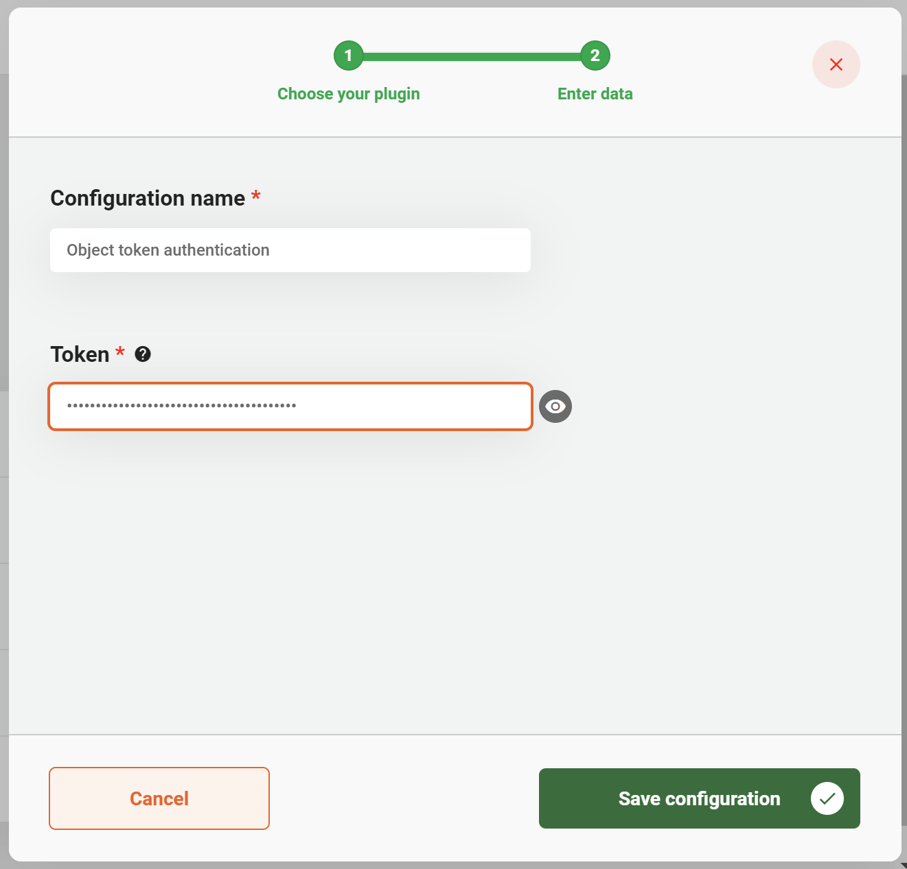

# Using the Object Token Auhentication Plugin

The Object Token Auhentication plugin is used to provide authentication for ZGW (Zaakgericht Werken) plugins that connect to APIs which 
use a token as authentication. Currently the plugins that this plugin can provide authentication for are the following:

- [Objecten API](../objecten-api/configure-plugin.md)
- [Objecttypen API](../objecttypen-api/configure-plugin.md)

### Prerequisites

This page requires you to have knowledge on how to configure Objecten API.

## Configuring the plugin

A plugin configuration is required before the plugin can be used. A general description on how to configure
plugins can be found [here](../configure-plugin.md).

If the Object Token Auhentication plugin is not visible in the plugin menu, it is possible the application is missing a dependency.
Instructions on how to add the Object Token Auhentication dependency can be found 
[here](/valtimo-implementation/modules/objecttokenauthentication.md).

To configure this plugin the following properties have to be entered:
- **Token.** The token is configured in the Objects administration page 'api authorizations'. The token should have permissions 
to object(types) registered to it.

An example plugin configuration:

