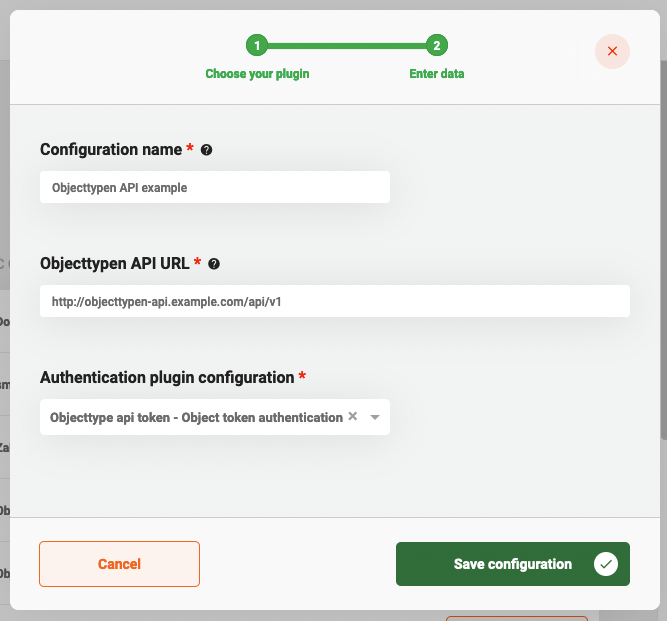

# Using the Objecten API Plugin

The Objecten API plugin can be used to store and access data about an Object in an application that supports the
Objecten API standard created and used by the Dutch government.

## Configure the plugin

A plugin configuration is required before the plugin can be used. A general description on how to configure
plugins can be found [here](../configure-plugin.md).

If the Objecten API plugin is not visible in the plugin menu, it is possible the application is missing a dependency.
Instructions on how to add the Objecten API dependency can be found
[here](/getting-started/modules/zgw/objecten-api.md).

To configure this plugin the following properties have to be entered:
- **URL (`url`).** Contains the complete base URL of the Objecten API to connect to. This generally includes 
the path `/api/v1/`.
- **Authentication plugin configuration (`authenticationPluginConfiguration`).** Reference to another plugin configuration that will be used to add 
authentication to any request performed on the Objecten API. If no option is available in this field a plugin has to 
be configured that is able to authenticate for the specific application that hosts the Objecten API. 
(e.g. Object Token Authentication)

An example plugin configuration:

## Using the plugin

The Objecten API plugin is used with REST endpoints. The following endpoints are currently provided:
- **Get objects of certain type linked to document**

  `/document/{documentId}/zaak/object?typeUrl={typeUrl}`
    - Response type: `Array<{index: number; registrationAt: string; title: string; url: string}>`

## Available actions

The Objecten API plugin supports the following actions that can be configured in process links in order to manage data that
is part of the object. 

A general description on how to create process links, can be found [here](../../process-link/create-process-link.md).

### Delete object

The **Delete object** action permanently deletes an object from the Obecten API. The object can no longer be retrieved and any URL referencing that object has become obsolete.
When creating a process link the following properties have to be entered:

- **Object URL.** A URL referencing the object that should be deleted.
