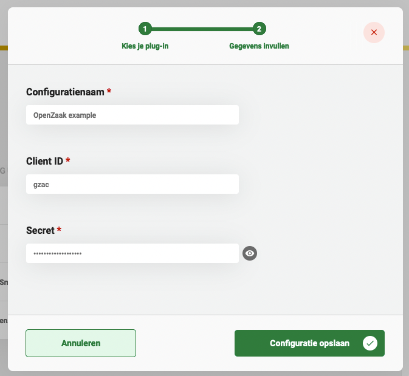

# Using the OpenZaak Plugin

The OpenZaak plugin can be used to provide authentication for ZGW (Zaakgericht Werken) plugins that connect to APIs which 
are supported in openzaak. Currently the plugin that this plugin can provide authentication for are the following:

- [Documenten API](../documenten-api/configure-plugin.md)
- [Zaken API](../zaken-api/configure-plugin.md)

## Configuring the plugin

In order to use this plugin a configuration has to be created. A general description on how to configure
plugins, can be found [here](../configure-plugin.md).

If the OpenZaak plugin is not visible in the plugin menu, it is possible the application is missing a dependency.
Instructions on how to add the OpenZaak dependency can be found 
[here](../../../valtimo-implementation/modules/openzaak.md)

The 'Client ID' and 'Secret' have to match these field as configured for the 'Applicatie' in OpenZaak.
These can be found by going to 'API Autorisaties' &rarr; 'Applicaties' in the menu of the management interface of the 
OpenZaak application. Here an existing application can be accessed to view the credentials, or a new one can be created 
if it does not exist yet.

An example plugin configuration:
