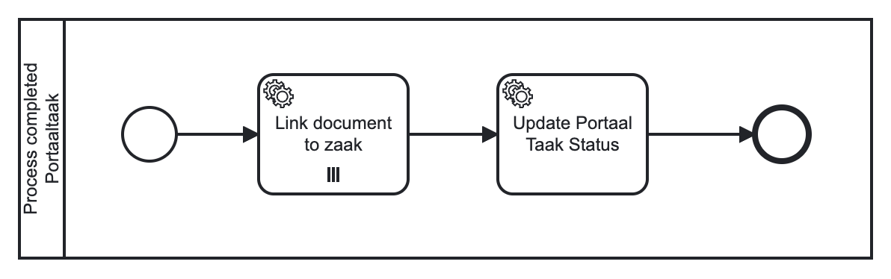

# Using the Portaal taak Plugin

The Portaal Taak plugin is used to generate "taak" (task) objects within the Objecten API for a BPMN 
user task. These tasks can then be completed via external applications, such as the NL Portal. This feature 
empowers Valtimo to assign certain tasks to other systems that are more adept at performing these specific tasks. 
Furthermore, it enables users who lack access to the Valtimo frontend to access these tasks.

## How does the plugin work

The lifecycle of a portaal taak is as follows:
1. When a process instance reaches a user task configured with the [Create Portaal taak](#create-portaal-taak) action
an instance of the task is created in Valtimo as usual. Additionally, a taak object is created in the Objecten API of
object type `Taak`. The status of the taak object will be `open`. The taak object includes information on who the 
intended recipient is. This is the person or organization that is supposed to complete the task.
2. External applications, such as the NL Portal, can retrieve the task information and offer a way to 
complete the task. Often this will be a form to input data. 
3. When the user completes the task in the external system, this system will update the taak object with the new data
and change the status in the object to `ingediend`.
4. The Objecten API should send a notification to the Notificaties API indicating the object has been updated.
5. Valtimo should be subscribed to notifications from the Notificaties API as part of the plugin setup and will receive
the notification. When an update notification for a taak object is received Valtimo will check the status. If this is 
set to `ingediend` the updated data from the taak object will be stored based on the value resolver configuration, and 
the handling process will be started.
6. As part of the handling process the [Complete Portaal taak](#complete-portaal-taak) action should be used. This 
action will complete the task in Valtimo and update the zaak object status to `verwerkt`, indicating the taak has 
been processed. 
   
## Configure the plugin

A plugin configuration is required before the plugin can be used. A general description on how to configure
plugins can be found [here](../configure-plugin.md).

If the Portaal taak plugin is not visible in the plugin menu, it is possible the application is missing a dependency.
Instructions on how to add the Portaal taak Plugin dependency can be found
[here](/getting-started/modules/zgw/portaaltaak.md).

To configure this plugin the following properties have to be entered:
- **Notification API plugin.** Reference to another plugin configuration that will be used to receive notification on
updates to objects. This is needed for completing tasks of which the status has been updated.
- **Object management configuration.** Reference to the object management configuration that can be used to store the
taak objects. If no option is available in this field, an object management configuration has to be created first.
- **Process to complete Portaaltaak.** Reference to the process that will be started to handle completion of tasks.
This can do additional steps like handling the file attachments. A process task should be configured in this process 
definition to handle the completion itself. This can be done using the [Complete Portaal taak](#complete-portaal-taak) 
plugin action. The process 'Process completed Portaaltaak' that is shipped with Valtimo can be used here. See 
[this section](#configuring-the-task-completion-process ) on how to set up this process. 

An example plugin configuration:

## Configuring the task completion process 

When a task object is updated and Valtimo receives the notification, a process is started to handle additional steps needed 
for completing the task. Because the task can only be considered completed when all other processing of data has 
happened, the actual completion of the task in the BPMN engine is also part of the plugin action that should be configured in this process.

The process that is started needs to be configured in the plugin properties by setting the 'Uploaded documents handler process'
property. Valtimo ships with the `Process completed Portaaltaak` process which has two tasks.

These tasks need to be configured with process links before the process can be used. The following actions should 
be configured:
- Link document to zaak - [Link document to zaak](../zaken-api/configure-zaken-api-plugin.md#link-document-to-zaak) in the Zaken API plugin
- Update Portaal Taak Status - [Complete Portaal taak](#complete-portaal-taak) in the Portaal Taak plugin

### Custom process

Instead of using the `Process completed Portaaltaak` process it is possible to create another process that will
handle task completion in a different way. The process is started with a few process variables that can be used when 
designing another process definition. These variables are:
- **portaalTaakObjectUrl.** The URL of the taak object.
- **objectenApiPluginConfigurationId.** The id of the Objecten API plugin configuration that can be used to get or edit 
the taak object.
- **verwerkerTaakId.** The id of the task to be completed. 
- **documentUrls.** A list of document URLs of documents stored in the Documenten API. Can be used as Collection in BPMN
multi-instance elements to iteratte over the list.

## Available actions

The portaal taak plugin supports the following actions that can be configured in process links in order to create and 
complete user tasks through external systems like the NL Portal.

A general description on how to create process links can be found [here](../create-process-link.md).

### Create Portaal taak
        
The **Create portal task** action is linked to a user task that can be completed in an external system. A taak object is
created when the task is reached, in the Objecten API as configured for the object management configuration referenced 
in the plugin configuration.

When creating a process link the following properties have to be entered:
- **Form type.** The type of form to be used for completing the user task. Options are:
  - **Form definition.** Use a form definition that the receiving system is supposed to understand
  - **URL' when using.** a url to the form definition.
- **Formulier ID.** The identifier of the form in the receiving system. Field is only available when using form type 'Form definition'.
- **Formulier URL.** The URL of the form definition. Field is only available when using form type 'URL'.
- **Task data for the recipient.** The data in Valtimo that is relevant to the task and should be included for 
prefilling in the task form. This fills a json object of data in the taak object. Every key is a json pointer to the
property in the taak object data. The value is a value resolver string that is used to fill the property.
- **Information entered by the recipient.** This is the mapping used to transfer the data received in the taak back to 
the case. Every key is a value resolver string that is used to update the data in Valtimo. The corresponding value is a
json pointer to the property in the taak object that contains the data.
- **Receiver.** Indicates how to find the recipient of the task. Options are: 
  - **Case initiator.** Use the user that is linked by the zaak rol as the initiator of the case. 
  - **Other.** Manually select a recipient. 
- **Identification key.** Indicates what kind of recipient the task has. Required when choosing receiver type 'Other'.
For example 'bsn' can be used to identify a user where BSN is the key.
- **Identification value.** Indicates which user is the recipient of the task. Required when choosing receiver type
'Other'. For example when Identification key 'bsn' is used, the value could be '059861095' to indicate that is the BSN 
of the user.

An example process link configuration:

### Complete Portaal taak
        
The **Complete Portaaltaak** action should be used in the `Process to complete Portaaltaak` to do the last step in 
handling the update from the objects API. When executed it will complete the user task and update the status of the 
taak object to `verwerkt`. After this plugin action has been selected, the user does not have to input any 
configuration data.
