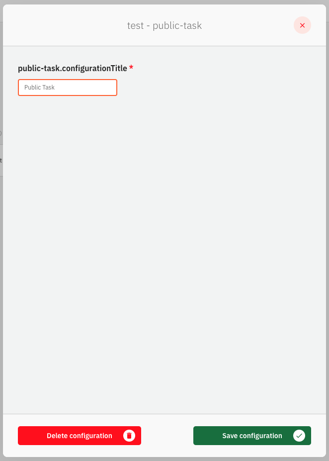
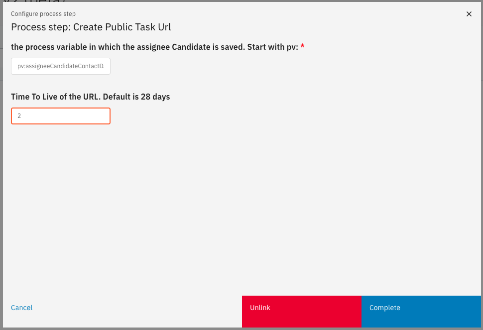
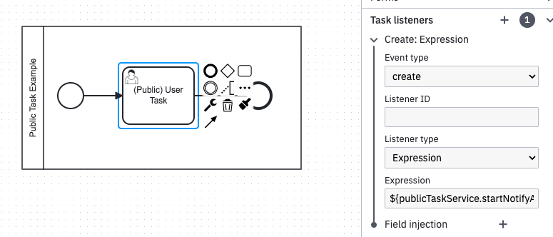
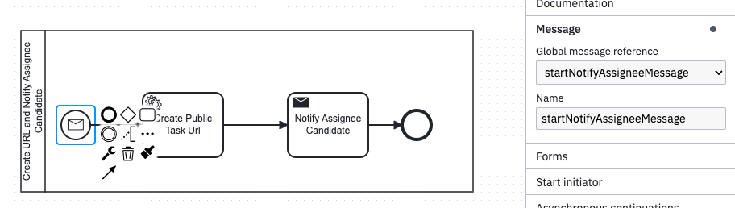

# Public Task Plugin

The Public Task Plugin exposes a User Task outside of the Valtimo user environment. It generates an HTML, an assignee candidate receives a URL and is able to submit the task within the HTML. 
From there Valtimo will pick up the submission and complete the task.

The Public Task Plugin is not a standard part of Valtimo. It is available in the Plugins Repo. More information can be found [here](/introduction/modules/plugin-introduction.md#plugins-repo).

## Configure the plugin

A plugin configuration is required before the plugin can be used. A general description on how to configure
plugins can be found [here](../configure-plugin.md).

This plugin has no specific configuration properties besides the plugin title.

An example plugin configuration:

## Available actions

The Public Task plugin supports the following actions that can be configured in process links in order to store
documents and their metadata.

A general description on how to create process links, can be found [here](../../process-link/create-process-link.md).

### Create Public Task

The **Create Public Task** renders a URL with a public task id. This URL can be sent to the assignee candidate and fetches an automatically generated HTML, 
with the Form.io form of the User Task in question. This form can be completed the same as within Valtimo and sends the submission to the plugin, which uses the submission,
in combination with the public task id, to complete the User Task and store the data in the Document.

When creating a process link the following properties have to be entered:
- **AssigneeCandidateContactData**: It is up to the implementation by what means the URL is communicated. The contact data of the user needs to be a process variable. The variable name needs to be set here. Starting with pv:
- **TimeToLive**: This is the amount of days that the Public Task remains available after initialization.

an example process link configuration: 

### Implementing the plugin
The plugin is designed to be able to be added to an existing user task. Because Valtimo can only link 1 action to a task, and this needs to be the form, the following can be done:

1. Add a **Task listener** with a **Create: Expression**. In the expression, add the following function call: **${publicTaskService.startNotifyAssigneeCandidateProcess(task)}**. 
   
An example of the process: 

 
2. This will correlate a message to start a new subprocess. Add this subprocess to the implementation.
   
An example of the process: 

3. Link the Process Link to the **Create Public Task URL task**
4. Implement a notification function to send the URL to the Assignee candidate
5. Part of the plugin code is a controller with two endpoints. The first endpoint will be called by the created URL and will send a HTML back with the form that is linked to the usertask
6. The second endpoint is called by the form which will contain the submission of the form and will complete the task with said submission. 

Note: examples of the processes can be found in the repo of the plugin. This is only an option for implementation.

### Audit

When a public task is completed, this will be logged as a **Public Task**