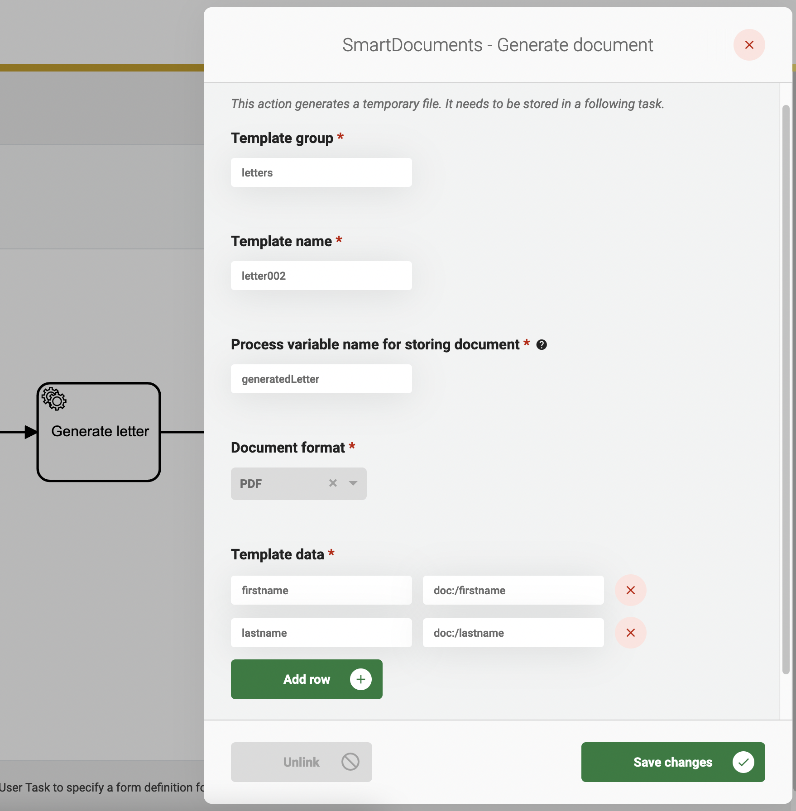

# Using the SmartDocuments Plugin

## Setup

Before using the SmartDocuments Plugin, the plugin has to be configured. This is
explained [here](../configure-plugin.md). A general description on how to create process links, can be found [here](../create-process-link.md).

## Generate documents

Both the 'Template group' and 'Template name' can be retrieved from the SmartDocuments application.

The 'Process variable name for storing document' is the name of the process variable where the generated document is
stored. This process variable can be used to access the document in another BPMN task.

The 'Document format' contain all supported formats for the generated document.

A document is generated with data taken from the 'Template data'. The value on the left-hand side must match the
placeholder in the SmartDocuments template. The value on the right-hand side can contain any of the following values:

1. A fixed value. This value will be put directly into the template without alterations. For example `John`
2. A value retrieved from the case-data. This value should start with `doc:` and should end with the path to the
   case-data property. For example `doc:/firstname`.
3. A value retrieved from a process variable. This value should start with `pv:` and should end with the name of the
   process variable. For example `pv:firstname`.

After filling in all fields, the process-link can be saved. Now everytime the service-task is executed, a document is
generated. Remember that the generated document is not visible anywhere yet. A logical next step is to handle the
generated document. For example, the next service-task can add the generated document to the case.

