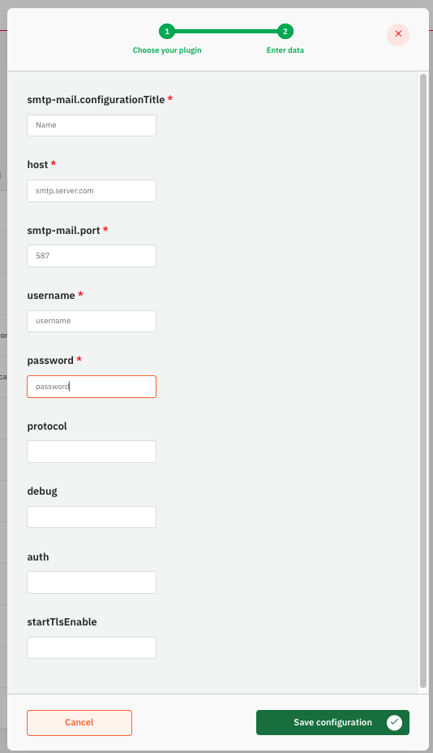
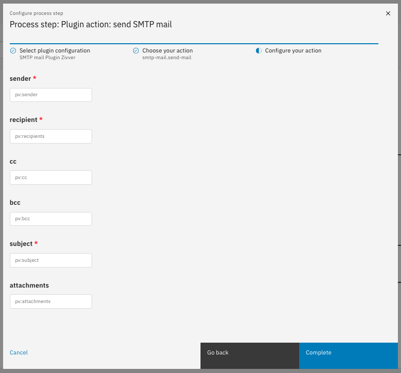

# SMTP Mail Plugin

The SMTP Mail Plugin lets you send emails using any SMTP server.

The SMTP Mail Plugin is not a standard part of Valtimo. It is available in the Plugins Repo. More information can be found [here](https://docs.valtimo.nl/readme/modules/plugin-introduction#plugins-repo).

## Configure the plugin

A plugin configuration is required before the plugin can be used. A general description on how to configure
plugins can be found [here](../configure-plugin.md).

To configure this plugin the following properties have to be entered:

- **Title**. The name of the plugin. 
- **Host**. The address of the SMTP server.
- **Port**: The port number of the SMTP server, usually 587.
- **Username**: The SMTP server login name. Not required. 
- **Password**: The SMTP server password. Not required.
- **Protocol**: The email protocol. Default is set to "smtp". 
- **Debug**: Gives more specific logging. Default is set to true.
- **Auth**: Determines whether logging is needed . Default is set to true.
- **StartTlsEnable**: This sets up secure TLS encryption. Default is set to true.

An example plugin configuration:

## Available actions

The SMTP mailplugin supports the following actions that can be configured in process links in order to store
documents and their metadata.

A general description on how to create process links, can be found [here](../../process-link/create-process-link.md).

### Send email

The **Send email** action takes mail metadata and temporary storage resourceId's of the attachments from the 
process variables of the process, fetches the HTML and attachments from the Valtimo Temporary Storage and sends
this data to the SMTP server.

When creating a process link the following properties have to be entered:
- **Sender**: Mail address of the sender.
- **Recipients**: Mail address(es) of the receivers.
- **CC**: Mail address(es) to send a copy of the email.
- **BCC**: Mail address(es) to send a copy of the email. Recipients are hidden. 
- **Subject**: Subject of the email. 
- **Attachments**: The resource id of files (in Valtimo Temporary Storage) that need to be send with the mail.

Use process variables/process links to select multiple items for recipients, CC, BCC and attachments.

an example process link configuration:

### Creating the Email Body
This plugin does not create the email body. For this it is needed to

1. Make the email content separately. 
2. Store it in Valtimo temporary storage. 
3. Store the resource id in Process Variables with the key **resourceId**

Use e.g. SmartDocuments or upload documents in Form.io to generate and store content.