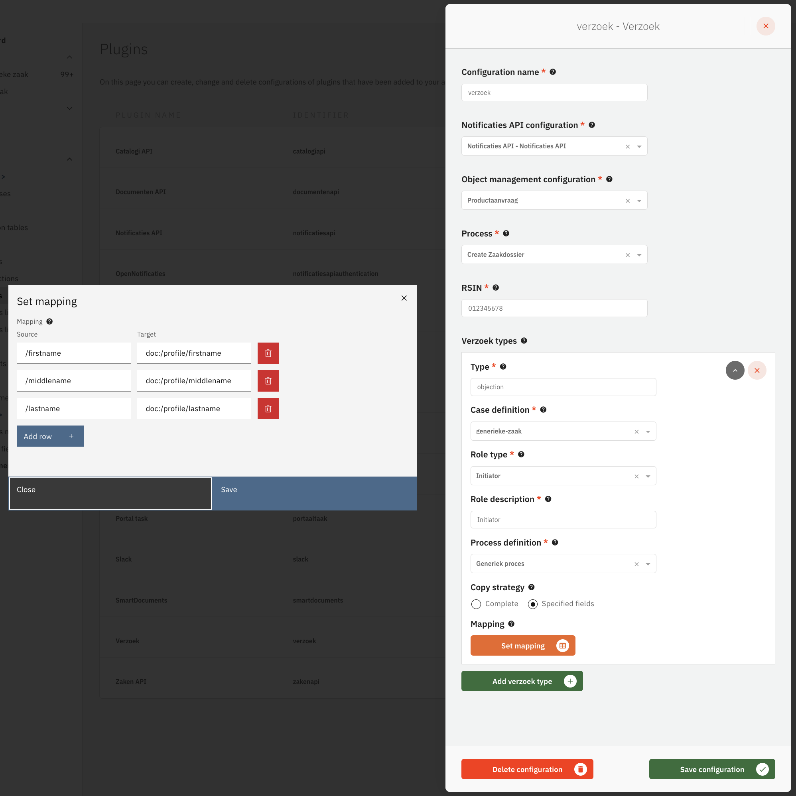
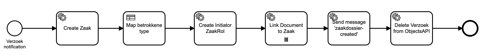
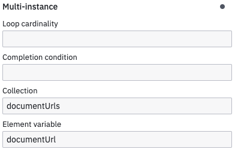

# Using the Verzoek Plugin

The Verzoek plugin (formerly known as Productaanvraag) is used to create a Valtimo case with GZAC zaak. This verzoek
plugin is triggered by a notification
by a user has submitted a form in OpenFormulieren. Once the notification is received, the Verzoek plugin starts BPMN
system process which will
eventually create a Valtimo case and a GZAC zaak.

## How does the plugin work

The lifecycle of a verzoek is as follows:

1. A user submits a form in OpenFormulieren. The form that the user submitted was configured to use the Verzoek plugin
   to handle the form submission.
2. After the form submission, OpenFormulieren creates a Verzoek object in the Objecten API and send a OpenNotificaties
   notification to Valtimo.
3. The Verzoek plugin in Valtimo receives the Verzoek notification. The Verzoek plugin then retrieves the Verzoek object
   from the Objecten API and using the data inside the verzoek object, the plugin will create a Valtimo case and start a
   BPMN system process.
4. The BPMN system process can be configured to do a number of things. But if the default system process 'Create
   Zaakdossier' is configured, it will:
    1. Create a zaak in OpenZaak.
    2. Uses a DMN table to decide whether a 'natuurlijk persoon' or a 'niet natuurlijk persoon' is the initiator of the
       zaak.
    3. Creates the initiator of the zaak as a zaak-rol in OpenZaak.
    4. All documents submitted by the user in OpenFormulieren are linked to the zaak.
    5. Send a BPMN correlation message that can be used to star another BPMN process.
    6. Delete the Verzoek object from the Objecten API.

## Configure the plugin

A plugin configuration is required before the plugin can be used. A general description on how to configure
plugins can be found [here](../configure-plugin.md).

If the Verzoek plugin is not visible in the plugin menu, it is possible the application is missing a dependency.
Instructions on how to add the Verzoek Plugin dependency can be found
[here](/getting-started/modules/zgw/verzoek.md).

To configure this plugin the following properties have to be entered:

- **Notification API plugin.** Reference to another plugin configuration that will be used to receive notification on
  updates to objects. This is needed for completing tasks of which the status has been updated.
- **Object management configuration.** Reference to the object management configuration that can be used to store the
  taak objects. If no option is available in this field, an object management configuration has to be created first.
- **Process.** Reference to the process that will be started after the plugin received a notification from
  OpenNotificaties. This process can do additional steps like creating the zaak and handling file attachments.
  See [this section](#configuring-the-create-zaakdossier-process) on how to set up this process.
- **RSIN.** Contains the RSIN of the organisation. The RSIN number (Rechtspersonen en
  Samenwerkingsverbanden Identificatie Nummer in Dutch) is an identification number for legal entities and partnerships.
  This will be used when storing document to indicate who is responsible for creating the Document record in the API.
- **Verzoek types.** asdf
    - **Type.** asdf
    - **Case definition.** asdf
    - **Role type.** asdf
    - **Role description.** asdf
    - **Process definition.** asdf
    - **Copy strategy.** asdf
    - **Mapping.** asdf
        - **Source.** asdf
        - **Target.** asdf

An example plugin configuration:

## Configuring the 'Create Zaakdossier' process

When a verzoek object is created and Valtimo receives the notification, a process is started to handle additional steps
needed for creating the zaak.

The process that is started needs to be configured in the plugin properties by setting the 'Process'
property. Valtimo ships with the `Create Zaakdossier` process which has six tasks.

These tasks need to be configured with process links before the process can be used. The following actions should
be configured:

- Create zaak - [Create ZaakRol](#create-zaak) in the Zaken API plugin
- Create initiator ZaakRol - [Create ZaakRol](#create-zaakrol) in the Zaken API plugin
- Link document to zaak - [Link document to zaak](../zaken-api/configure-zaken-api-plugin.md#link-document-to-zaak) in
  the Zaken API plugin
- Delete Verzoek from ObjectsAPI - [Delete Verzoek](#delete-verzoek) in the Objects API plugin

### Custom process

Instead of using the `Create Zaakdossier` process it is possible to create another process that will
handle zaak creation in a different way. The process is started with a few process variables that can be used when
designing another process definition. These variables are:

- **RSIN.** The RSIN configured in the Verzoek plugin.
- **zaakTypeUrl.** The URL of the zaak-type that is associated to the document definition.
- **rolTypeUrl.** The URL of the rol-type that is configured in the Verzoek plugin.
- **rolDescription.** The rol description that is configured in the Verzoek plugin.
- **verzoekObjectUrl.** The url from the verzoek object in the Objecten API.
- **initiatorType.** The type of the initiator of this verzoek. Usually has the value 'kvk' or 'bsn'.
- **initiatorValue.** The ID of the initiator. This is usually a BSN or KVK number.
- **processDefinitionKey.** The key of the process-defintion that should be started after this process.
- **documentUrls.** A list of document URLs of documents stored in the Documenten API. Can be used as Collection in BPMN
  multi-instance elements to iterate over the list.

## Available actions

The verzoek plugin supports the following actions that can be configured in process links in order to create and
complete user tasks through external systems like the NL Portal.

A general description on how to create process links can be found [here](../create-process-link.md).

### Create Zaak

The **Create portal task** action is linked to a user task that can be completed in an external system. A taak object is
created when the task is reached, in the Objecten API as configured for the object management configuration referenced
in the plugin configuration.

When creating a process link the following properties have to be entered:

- **Form type.** The type of form to be used for completing the user task. Options are:
    - **Form definition.** Use a form definition that the receiving system is supposed to understand
    - **URL' when using.** a url to the form definition.
- **Formulier ID.** The identifier of the form in the receiving system. Field is only available when using form type '
  Form definition'.
- **Formulier URL.** The URL of the form definition. Field is only available when using form type 'URL'.
- **Task data for the recipient.** The data in Valtimo that is relevant to the task and should be included for
  prefilling in the task form. This fills a json object of data in the taak object. Every key is a json pointer to the
  property in the taak object data. The value is a value resolver string that is used to fill the property.
- **Information entered by the recipient.** This is the mapping used to transfer the data received in the taak back to
  the case. Every key is a value resolver string that is used to update the data in Valtimo. The corresponding value is
  a
  json pointer to the property in the taak object that contains the data.
- **Receiver.** Indicates how to find the recipient of the task. Options are:
    - **Case initiator.** Use the user that is linked by the zaak rol as the initiator of the case.
    - **Other.** Manually select a recipient.
- **Identification key.** Indicates what kind of recipient the task has. Required when choosing receiver type 'Other'.
  For example 'bsn' can be used to identify a user where BSN is the key.
- **Identification value.** Indicates which user is the recipient of the task. Required when choosing receiver type
  'Other'. For example when Identification key 'bsn' is used, the value could be '059861095' to indicate that is the BSN
  of the user.

An example process link configuration:

### Create ZaakRol

asdf

### Delete Verzoek

The **Delete Verzoek** action should be used in the `Create Zaakdossier` to do the last step in
handling the deletion from the objects API. When executed it will complete the user task and update the status of the
taak object to `verwerkt`. After this plugin action has been selected, the user does not have to input any
configuration data.
