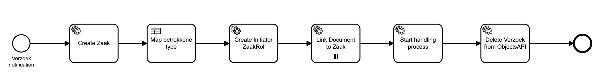

# Using the Verzoek Plugin

The Verzoek plugin (formerly known as Productaanvraag) is used to create a Valtimo case with GZAC zaak. The verzoek
plugin is triggered by a notification from the Notificaties API. Once the notification is received, the Verzoek plugin
will use BPMN process to create a Valtimo case with a GZAC zaak.

## How does the plugin work

The lifecycle of a verzoek is as follows:

1. A Verzoek object is created in the Objecten API (for example, by OpenFormulieren). The Objecten API automatically
   creates a Noticitaties API notification to notify all applications that a new verzoek object was created.
2. The Verzoek plugin in Valtimo receives the notification from Noticitaties API. The Verzoek plugin then retrieves the
   Verzoek object from the Objecten API. Using the data inside the verzoek object, the plugin will create a Valtimo case
   and start a BPMN process to handle the verzoek.
3. The BPMN process can be configured to do a number of things. But if the default system process `Create Zaakdossier`
   is configured, it will:
    1. Create a zaak in the Zaken API.
    2. Use a DMN table to decide whether a 'natuurlijk persoon' or a 'niet natuurlijk persoon' is the initiator of the
       zaak.
    3. Link the zaak initiator to the zaak.
    4. Link all documents inside the verzoek to the zaak.
    5. Start a handeling BPMN process to further handle the verzoek.
    6. Delete the verzoek object from the Objecten API.

## Configure the plugin

A plugin configuration is required before the plugin can be used. A general description on how to configure
plugins can be found [here](../configure-plugin.md).

If the Verzoek plugin is not visible in the plugin menu, it is possible the application is missing a dependency.
Instructions on how to add the Verzoek Plugin dependency can be found [here](/getting-started/modules/zgw/verzoek.md).

To configure this plugin the following properties have to be entered:

- **Notification API plugin (`notificatiesApiPluginConfiguration`).** Reference to another plugin configuration that will be used to receive a notification
  when a new verzoek is made.
- **Process (`processToStart`).** Reference to the process that will be started after the plugin received a notification from
  Notificaties API. This process can do additional steps like creating the zaak and handling file attachments.
  See [this section](#configuring-the--create-zaakdossier-process) on how to set up this process.
- **RSIN (`rsin`).** Contains the RSIN of the organisation. The RSIN number (Rechtspersonen en
  Samenwerkingsverbanden Identificatie Nummer in Dutch) is an identification number for legal entities and partnerships.
  This will be used when storing document to indicate who is responsible for creating the zaak record in the API.
- **Verzoek types (`verzoekProperties`).** The verzoek plugin can be configured to handle multiple verzoek types. Each verzoek type can be
  handled in a different way.
    - **Type (`type`).** The type of the verzoek. This type should match the type that is inside the verzoek object from the
      Objecten API, in property `record.data.type`.
    - **Case definition (`caseDefinitionName`).** The Valtimo case definition that should be created when a verzoek was made.
    - **Object management configuration (`objectManagementId`).** Reference to the object management configuration that describes the verzoek
      object. If no option is available in this field, an object management configuration has to be created first.
    - **Role type (`initiatorRoltypeUrl`).** The role of the person who created the verzoek. Usually this is the zaak initiator role. The person
      who created the verzoek is linked to the zaak using this role.
    - **Role description (`initiatorRolDescription`).** This text describes the role of the person who initiated the verzoek.
    - **Process definition (`processDefinitionKey`).** The definition of the handling process. This process is started as a follow-up process to
      further handle the verzoek.
    - **Copy strategy (`copyStrategy`).** This option determines whether the entire verzoek data is included in the Valtimo case, or only
      the defined fields.
        - **Mapping (`mapping`).** Determines which fields of the verzoek data are copied to the Valtimo case or to the process variable.
            - **Source (`source`).** A jsonpointer that points to a property inside the verzoek data that should be
              copied. When this field is left empty, the entire source JSON will be copied to the target location.
            - **Target (`target`).** 
              - Starts with a `doc` prefix. A jsonpointer that points to a property inside the Valtimo case where the verzoek data should
                be pasted.
              - Starts with a `pv` prefix. A process variable where the verzoek data should be saved.

An example of plugin configuration with `doc:` prefix:

An example of plugin configuration with `pv:` prefix:

## Configuring the 'Create Zaakdossier' process

When a verzoek object is created and Valtimo receives the notification, a process is started to handle additional steps
needed for creating the zaak.

The process that is started needs to be configured in the plugin properties by setting the 'Process'
property. Valtimo is shipped with the `Create Zaakdossier` process which has six tasks.

The Create Zaakdossier process is started with a few process variables that can be used inside the process links. These
variables are:

- **RSIN.** The RSIN configured in the Verzoek plugin.
- **zaakTypeUrl.** The URL of the zaak-type that is associated to the document definition.
- **rolTypeUrl.** The URL of the rol-type that is configured in the Verzoek plugin.
- **rolDescription.** The rol description that is configured in the Verzoek plugin.
- **verzoekObjectUrl.** The url from the verzoek object in the Objecten API.
- **initiatorType.** The type of the initiator of this verzoek. Usually has the value 'kvk' or 'bsn'.
- **initiatorValue.** The ID of the initiator. This is usually a BSN or KVK number.
- **processDefinitionKey.** The key of the process-definition that should be started after this process.
- **documentUrls.** A list of document URLs of documents stored in the Documenten API. Can be used as Collection in BPMN
  multi-instance elements to iterate over the list.

The tasks inside the Create Zaakdossier process need to be configured with process links before the process can be used.
The following actions should be configured:

- Create zaak - [Create Zaak](../zaken-api/configure-zaken-api-plugin.md#create-zaak) in the Zaken API plugin. This
  plugin link can be configured using the process variables above. Namely:
    - `pv:RSIN`
    - `pv:zaakTypeUrl`
- Create initiator
  ZaakRol - [Create ZaakRol](../zaken-api/configure-zaken-api-plugin.md#create-zaakrol---natural-person) in the Zaken
  API plugin. This plugin link can be configured using the process variables above. Namely:
    - `pv:rolTypeUrl`
    - `pv:rolDescription`
    - `pv:initiatorValue`
- Link document to zaak - [Link document to zaak](../zaken-api/configure-zaken-api-plugin.md#link-document-to-zaak) in
  the Zaken API plugin. This plugin link can be configured using the process variables above. Namely:
    - `pv:documentUrl`
- Delete Verzoek from
  ObjectsAPI - [Delete Verzoek object](../objecten-api/configure-objecten-api-plugin.md#delete-object) in the Objects
  API plugin. This plugin link can be configured using the process variables above. Namely:
    - `pv:verzoekObjectUrl`

The 'Create Zaakdossier' process has several tasks with default configurations:

- Map betrokkene type - a task that uses a DMN table to determine what the zaak initiator type.

- Link Document to zaak - This task links all the documents from the verzoek to the zaak.

- Start handling process - This task starts a follow-up process that further handles the verzoek.

### Custom process

Instead of using the `Create Zaakdossier` process it is possible to create another process that will handle zaak
creation in a different way. The verzoek plugin must then be configured to use a custom process in the **Process**
field. The custom process will then automatically be started with all necessary process variables.

## Configuring the handling process

The system process `Create Zaakdossier` offers the possibility to start a follow-up process which will further handle
the verzoek. This handling process is started by the task `Start handling process`. The verzoek plugin configuration
property 'Process definition' decides which BPMN process will be started.
