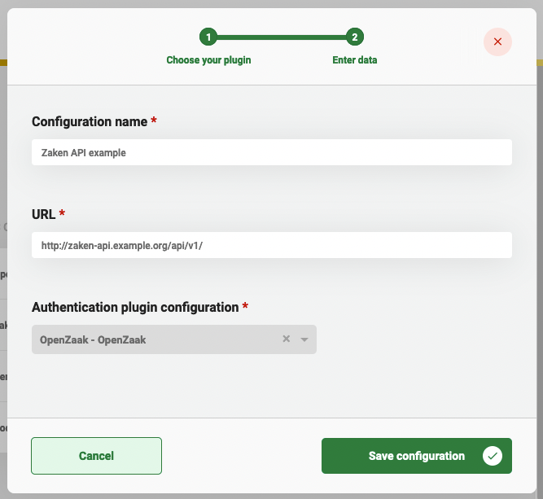
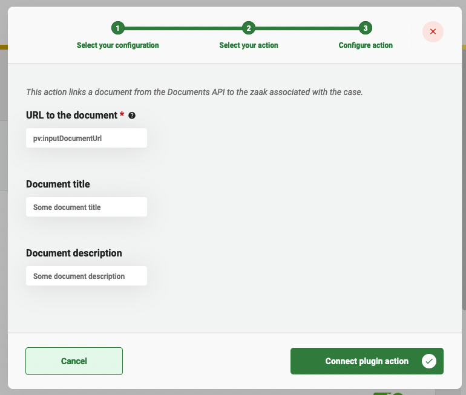

# Using the Zaken API Plugin

The Zaken API plugin can be used to store and access data about a Zaak (case) in an application that supports the
Zaken API standard created and used by the Dutch government.

## Configure the plugin

A plugin configuration is required before the plugin can be used. A general description on how to configure
plugins can be found [here](../configure-plugin.md).

If the Zaken API plugin is not visible in the plugin menu, it is possible the application is missing a dependency.
Instructions on how to add the Zaken API dependency can be found
[here](/valtimo-implementation/modules/documenten-api.md).

To configure this plugin the following properties have to be entered:
- **URL.** Contains the complete base URL of the Zaken API to connect to. This generally includes 
the path `/api/v1/`.
- **Authentication plugin configuration.** Reference to another plugin configuration that will be used to add 
authentication to any request performed on the Zaken API. If no option is available in this field a plugin has to 
be configured that is able to authenticate for the specific application that hosts the Zaken API. (e.g. OpenZaak)

An example plugin configuration:

## Available actions

The Zaken API plugin supports the following actions that can be configured in process links in order to manage data that
is part of the Zaak. Currently only linking a Document to an existing Zaak is supported.

A general description on how to create process links, can be found [here](../create-process-link.md).

### Link document to zaak

The **Link document to zaak.** action takes a Document stored in a Documenten API and links it to a zaak. The zaak to which 
the Document is linked is based on the process for which the action is performed. The process belongs to a case that
should already have a zaak instance link before this action is performed. The link between a zaak and a document is 
stored as a 'zaakinformatieobject' in the Zaken API.  

When creating a process link the following properties have to be entered:
- **URL to the document.** The complete URL of the document in a Documenten API.
- **Document title.** The title of the document within the context of the zaak that is stored in the
'zaakinformatieobject' record in the Zaken API.
- **Document description.** The description of the document within the context of the zaak that is stored in the
'zaakinformatieobject' record in the Zaken API.

An example process link configuration:

### Link uploaded document to zaak

The **Link uploaded document to zaak** action takes a document stored in a Documenten API and links it to a zaak. The
zaak to which the document is linked is based on the process for which the action is performed. The process
belongs to a case that should already have a zaak instance link before this action is performed. The link between a zaak
and a document is stored as a 'zaakinformatieobject' in the Zaken API. After this plugin action has been selected,
the user does not have to input any configuration data.
