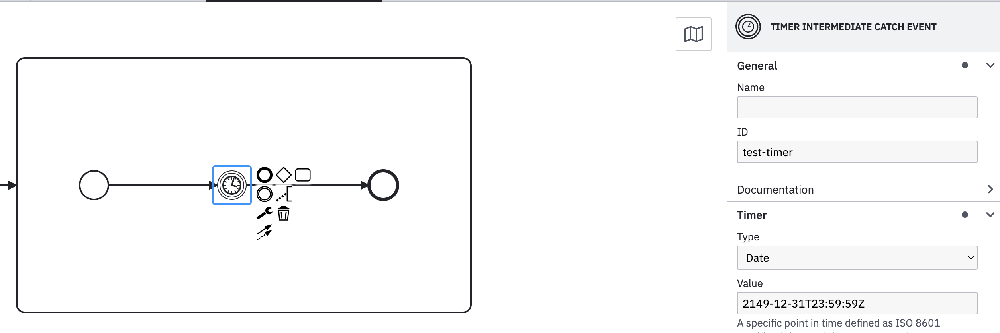
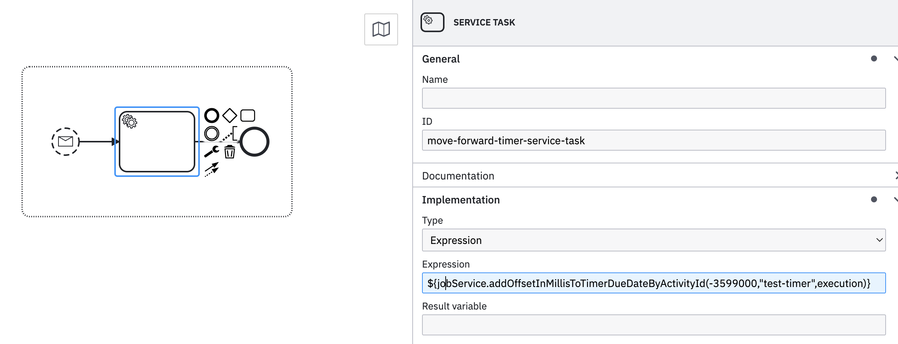

# Job service

This service is process bean that provides a way to manipulate jobs within the current process.

### Changing Timer event date  

Job service currently provides two methods that allow for an update on the timer due date in the current process.

```java
updateTimerDueDateByActivityId("2300-01-01T00:00:00Z","timer-id",execution);
addOffsetInMillisToTimerDueDateByActivityId(1000,"timer-id",execution);
```
- "updateTimerDueDateByActivityId" - allows changing the date by passing it as "String", in the ISO 8601 format , as the
  first parameter along with the timer event id and the current execution of the process as second and third parameters
  respectively.

- "addOffsetInMillisToTimerDueDateByActivityId" - used to add an offset to the current set due date by providing the amount
to be added(in milliseconds) by passing a positive number, or subtracted with a negative number.

##### How to use

In this example a timer exists with the given id "timer-test"



Somewhere else in the process a sub-process exists with a service task where
the job service is called in an expression with a negative number in order to move
forward a job in time as show below




