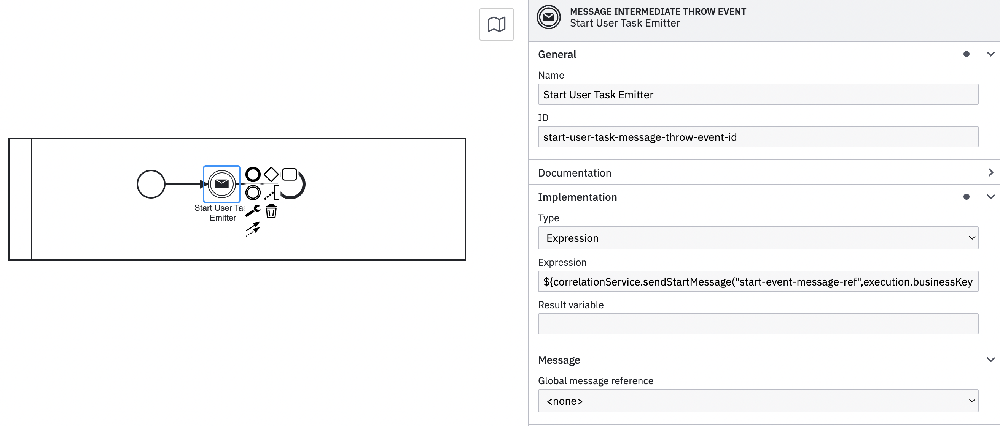
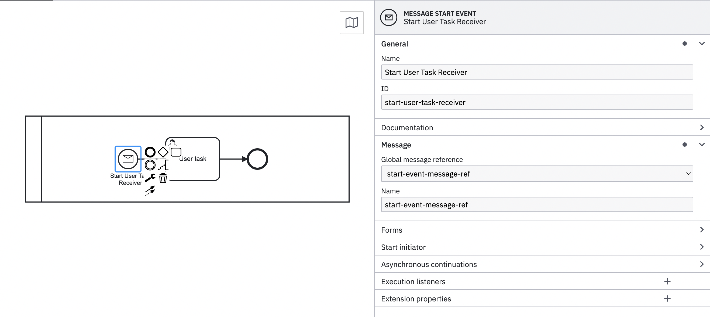

# Sending messages in BPMN

Valtimo provides a way to send messages to another process/sub-process allowing not only
correlation but association between processes and a Valtimo case.<br/>
To achieve this Valtimo provides a [ProcessBean](../../extending-valtimo/process/whitelist-spring-bean.md)
named "correlationService" with several methods to allow correlation

These methods can be used in expressions applied to message throw events like the following <br/><br/>

<br/><br/>
Then a message start event that holds the same message reference passed as the first argument of the method called
will create an instance of that process correlated with the business key provided as the second argument
<br/><br/>


### Correlating start events

Message correlation can be used to start processes in the Valtimo environment using the following methods

```kotlin
    fun sendStartMessage(message: String,businessKey: String?): MessageCorrelationResult
    fun sendStartMessage(message: String,businessKey: String?, variables: Map<String, Any>?): MessageCorrelationResult
    fun sendStartMessage(message: String,businessKey: String, variables: Map<String, Any>?, targetProcessDefinitionKey: String)
```

### Correlating to one intermediate catch event
```kotlin
    fun sendCatchEventMessage(message: String): MessageCorrelationResult
    fun sendCatchEventMessage(message: String, businessKey: String?): MessageCorrelationResult
    fun sendCatchEventMessage(message: String, businessKey: String?, variables: Map<String, Any>?): MessageCorrelationResult
```
### Correlating to multiple intermediate catch events
```kotlin
    fun sendCatchEventMessageToAll(message: String): List<MessageCorrelationResult>
    fun sendCatchEventMessageToAll(message: String, businessKey: String?): List<MessageCorrelationResult>
    fun sendCatchEventMessageToAll(message: String, businessKey: String?, variables: Map<String,Any>?): List<MessageCorrelationResult>
```
This can be used either to correlate to all message references if no business key is provided or to all message references for a specific business key
### Method arguments

These methods accept:<br/><br/>

| Parameter                  | Description                                                     | Optional | Remarks                                               |
|----------------------------|-----------------------------------------------------------------|----------|-------------------------------------------------------|
| message                    | The global message reference in the "message start event"       | No       |                                                       |
| businessKey                | The business key that will be correlated to the started process | Yes/No   | Can only be optional in multiple catch event scenario |
| variables                  | The variables that will be passed to started process context    | Yes      |                                                       |
| targetProcessDefinitionKey | The process definition key that will be correlated              | Yes      | Used exclusively in message start events              | 

<mark>Side note</mark><br/>
These methods can be used programmatically in custom code as correlation service is a spring bean