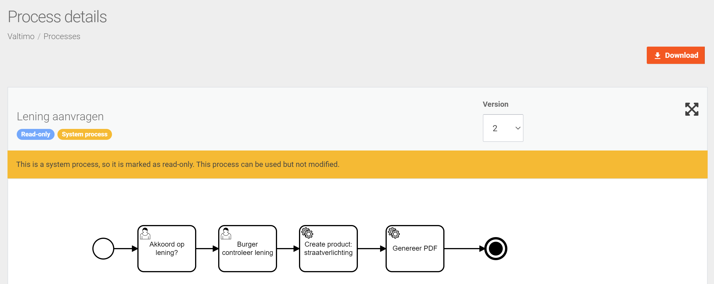
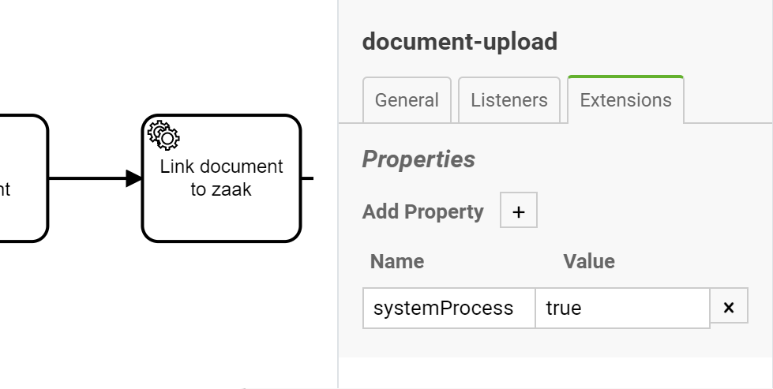
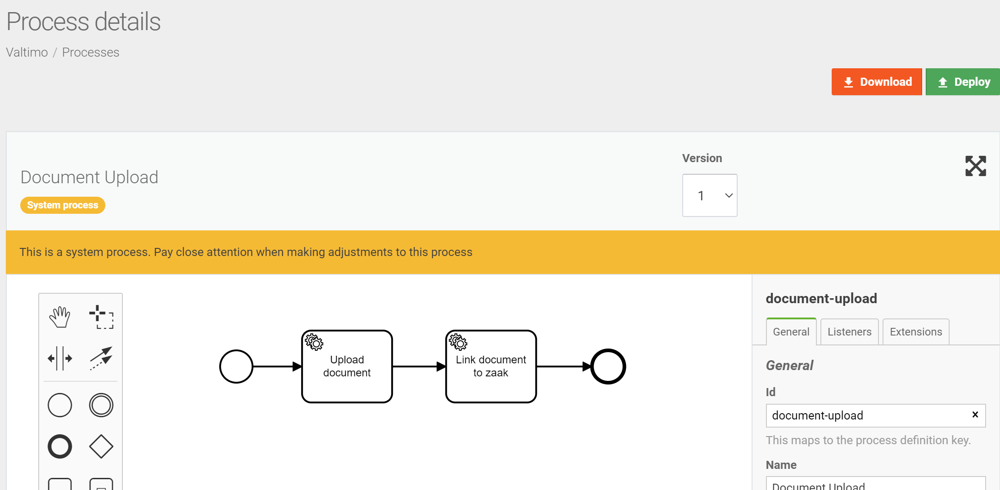

# System processes

System processes are a special kind of process. A system process describes an often used process 
that is used by the system. These process should be handled with care so when a process
is a system process it will be read-only by default. When a process is read-only it is not possible
to update the process or deploy it.



A process can be marked as a system process by setting a property called `systemProcess`
to the value `true` on the model itself under the `Extensions` tab



## Make system process updatable
It is possible to make a system process updatable / deployable. To override this a property has to
be set in the `application.yml` of the backend implementation. The property is called
`valtimo.process.systemProcessUpdatable` and this should have the value `true`. The default value of
this property is `false`

```yaml
valtimo:
    process:
        systemProcessUpdatable: true
```

When a system process is updatable it is possible to make changes to the process and the 
`Deploy` button is available again. But a message is still shown to warns the user to be
careful when making changes to a system process


