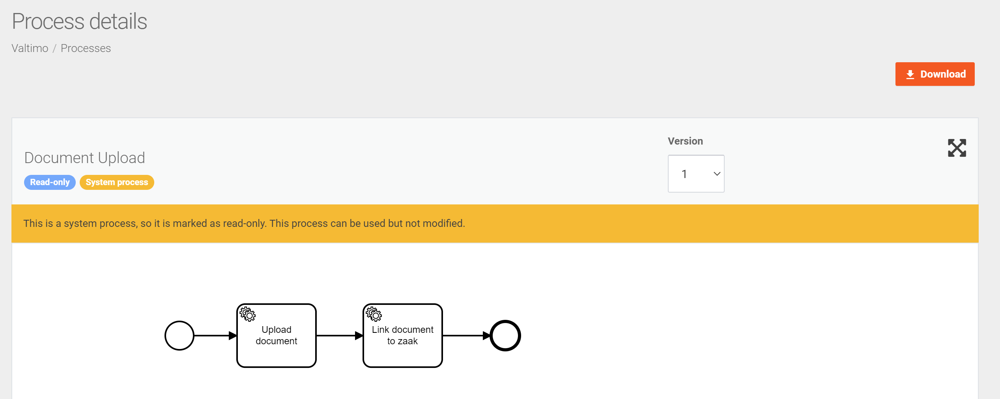

# System processes

System processes are processes that are critical to the functioning of Valtimo itself. Since these 
processes should be handled with care, these processes are flagged as read-only by default. When a 
process is read-only, it is not possible to update the process or deploy it.



A process can be marked as a system process by setting a property called `systemProcess`
to `true` on the model itself under the `Extensions` tab.


## Make system process updatable
By default, system processes are marked as read-only. To override this, a property has to be set 
in the `application.yml` of the back-end implementation. The property is called
`valtimo.process.systemProcessUpdatable` and this should have the value `true`. The default value of
this property is `false`.

```yaml
valtimo:
    process:
        systemProcessUpdatable: true
```

When a system process is updatable it is possible to make changes to the process and the
`Deploy` button is available again. A message is shown to warn the user about changing a
system process.


