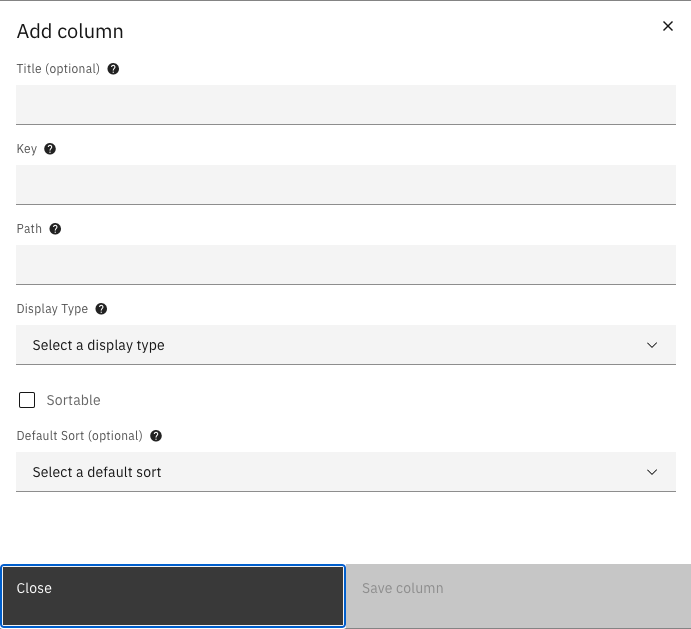

# Task list columns
Task list columns can be configured to change the visible columns in the task list.

## Configuration
Task list columns are configurable, and support defining properties like title, data path, display type and sorting.

### Via the UI
Configuration via the UI can be done at `Admin` -> `Tasks`. A list of the available cases will be shown. 
When selecting a case, a list of the configured Task list columns for that case will be shown. 

From here, it is possible to:
- Add columns
- Edit columns
- Sort columns
- Delete columns

#### Adding a column
A column can be added by clicking on the `Add column` button. This will open the following modal:


**Title:**
If this field is filled in, this title will display as the column header, overriding any available translations.

**Key:**
A unique key by which the column is identified. If the key is not unique, you will not be able to save the column.

**Path:**
A path which leads to the property you want to show. For the document's JSON schema, follow this example: 'doc:customer.firstName'. For document properties, follow these examples: 'case:createdBy', or 'case:sequence', or 'case:assigneeFullName'. Note: When there are special characters in a property, the property must be enclosed in quotes. For example: case:"loan-accepted".

**Display type:**
This option decides how the data is eventually displayed in the table.

**Sortable:**
Whether the column will be sortable by the user

**Default Sort:**
If this field has a value, the table will be sorted by default on this property, in the direction specified. Only one column at a time can have this property. On creating a new column, if another column already has a default sort specified, this input field will be disabled.

#### Exporting
When exporting a case, the configured task list columns will also be exported. The export files for task list columns can also be used for autodeployment.

#### Importing
When importing a case, the configured task list columns will also be imported.

### Autodeployment
Columns can also be autodeployed by adding json files on the classpath.
These files should end with `.case-task-list.json` to be eligible for autodeployment.

Every deployment file represents a changeset. These files are required to contain a `changesetId` that should be unique
over all deployment files that use changesets. When starting up, changesets that have already been executed will be ignored.
A checksum of the changeset is created when it is executed. Changesets that have already been deployed should not change.
Changesets that have been changed since a previous time will result in an error and failure to start the application.

All changesets can be executed again, even when the content has changed, by setting the `valtimo.changelog.case-task-list.clear-tables` property to `true`. 
By default, this setting is disabled.

**my-case.case-task-list.json**:
```json
{
  "changesetId": "my-case.case-task-list",
  "case-definitions": [
    {
      "key": "my-case",
      "columns": [
        {
          "title": "First name",
          "key": "first-name",
          "path": "doc:first-name",
          "displayType": {
            "type": "text",
            "displayTypeParameters": {}
          },
          "sortable": false
        },
        {
          "title": "Last name",
          "key": "last-name",
          "path": "doc:last-name",
          "displayType": {
            "type": "text",
            "displayTypeParameters": {}
          },
          "sortable": true,
          "defaultSort": "ASC"
        }
      ]
    }
  ]
}
```
