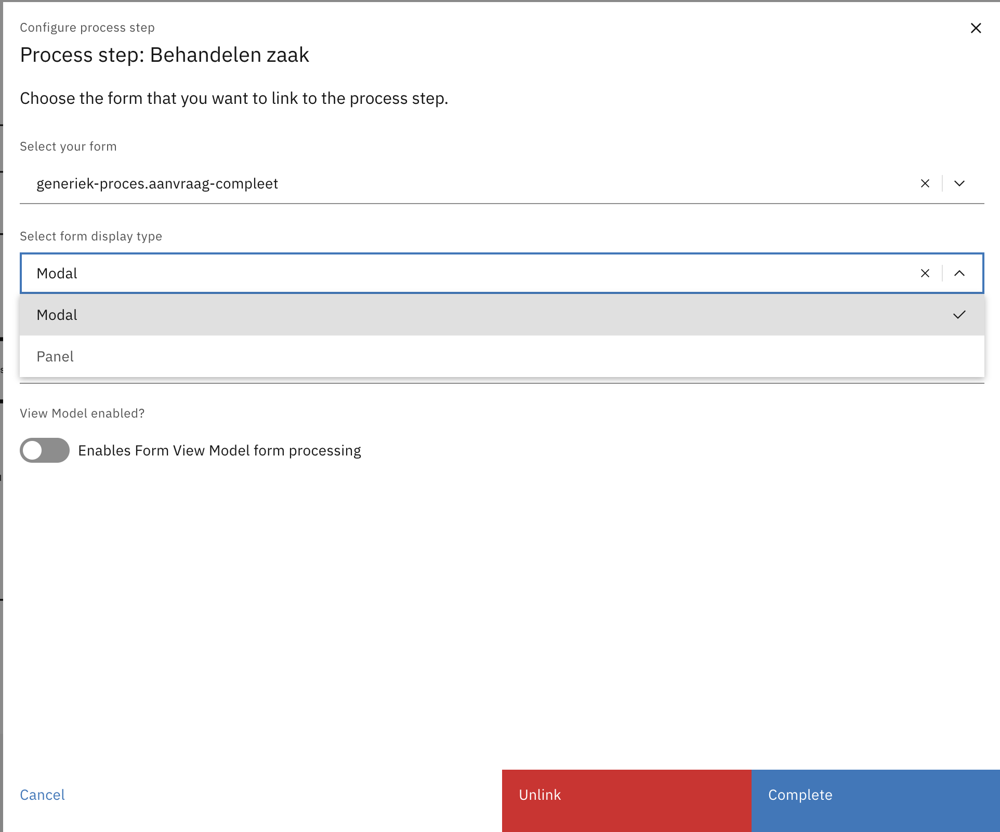
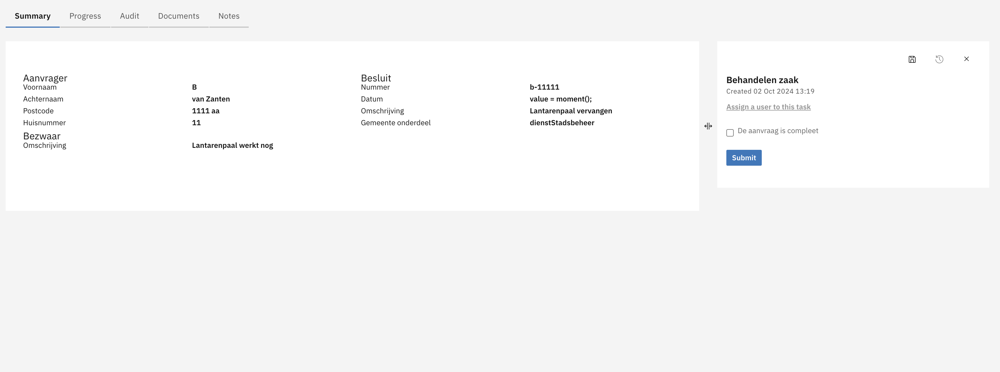
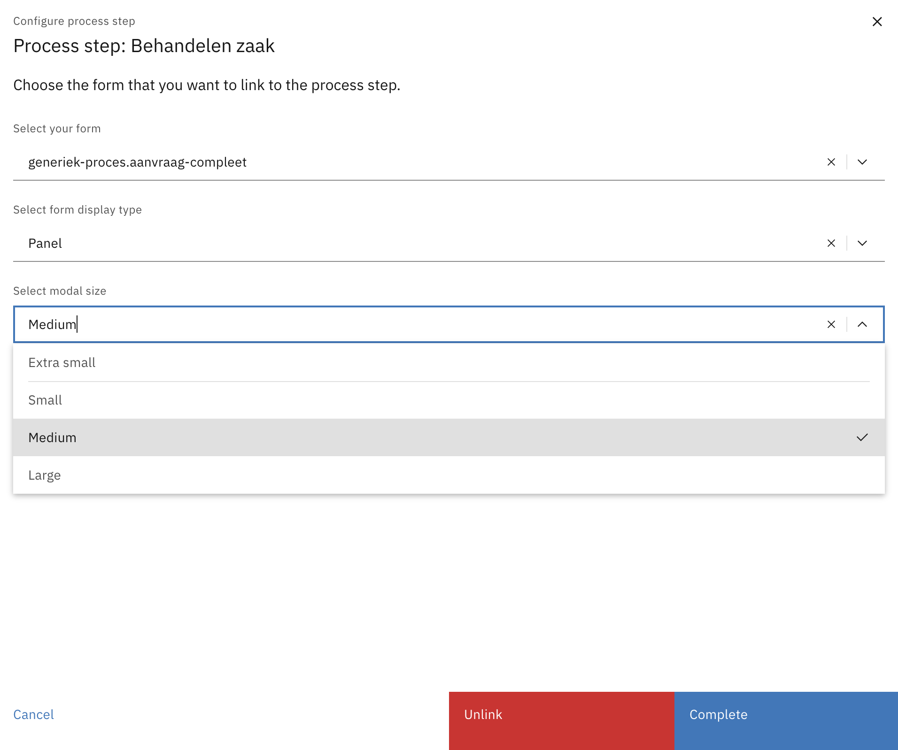
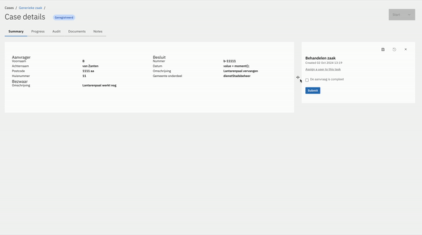

# Task Panel

In order to make filling in Task data easier, the task panel is open in the Case tabs and will stay open while navigating case data.

## Configuring Task Panel for user task

When linking a Form/Form-flow to a user task the following dropdown will appear in the configuration modal:

If *Modal* is selected, then the task will display inside of a modal, as before.

If *Panel* is selected then the task will display inside of a panel:

The size of the modal/panel can also be selected now:

If the Modal is selected, then it will just stick to that size.
However, if the Panel is selected, that size is just a minimum size, as the Panel itself is resizeable:

