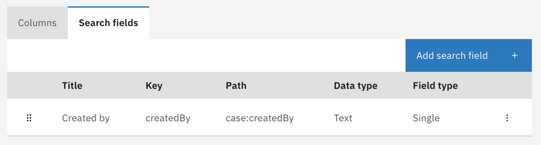
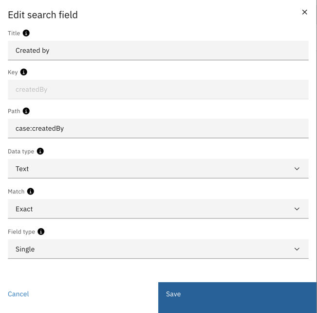

# Tasks

As part of a case process, some tasks need to be manually completed by a person. 
These tasks are called user tasks and often require some input of data or approval.

Valtimo only shows tasks to a user that have not been completed yet. 
They can be accessed via the case the task belongs to, or `Tasks` in the main menu.    

The `Tasks` menu item brings the user to a task list view, which combines tasks from different cases. 
The available categories are:
- **My tasks:** These are tasks that have been assigned to the current user.
- **Unassigned tasks:** These tasks have not been assigned to any user.
- **All tasks** This view shows all tasks regardless of assignment.

When clicking on a task from the list, it will open the form that the user can fill in to complete it. 
After completion, the task will no longer be visible to the user. 

A user can filter the tasks by case via the top dropdown:
- **When no case is selected**: tasks from all cases is shown. 
This view uses the task columns as configured in code. These columns cannot be changed via the UI.
- **When a case is selected**: the tasks are filtered by that case, and the columns as configured for that case are shown. 
For more information on configuring task list columns for a case, click [here](task-list-columns.md)

## Task filtering
Additional task filters can be configured on a case by an admin. 
These filters enable users to search tasks that meet one or more of the configured criteria. 

Since task filters are configured on a case, they will only be available when the user selects a case from the dropdown. 
For 'All cases', the additional filters will not be available.

### Using task filters
//TODO

### Configuring task filters
Task filters can be configured via the `Admin` -> `Tasks` menu on the left. 
To continue, a case needs to be selected on which the search fields need to be configured. These search fields will only be available for that case.

At the `Search fields` tab, search fields can be added, edited or removed.

When adding or editing a search field, the available options are similar to the case search fields:

//TODO

