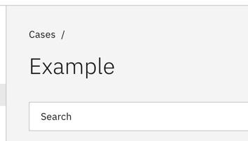
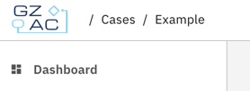

# User settings
Users can customize their view to fit their personal preferences. 
This page describes the available options and their effects. 

## Compact mode
By default, the breadcrumbs and page title reserve a larger portion of the vertical space on a users' screen, as can be seen below:

When the [`enableCompactModeToggle`](/reference/feature-toggles.md#front-end) toggle is enabled, the user can enable the 'Compact mode' feature from the settings.
This will move the breadcrumbs and page title to the top space next to the logo:

