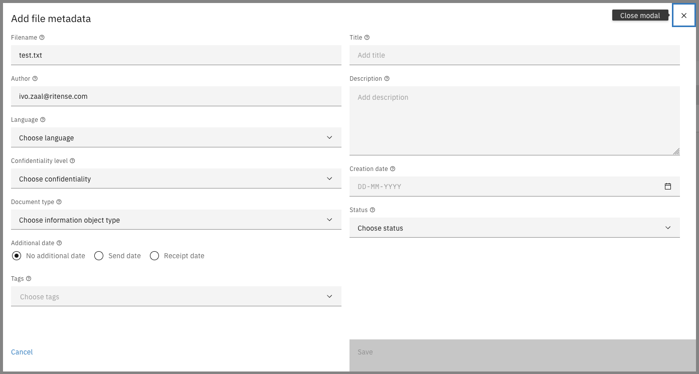
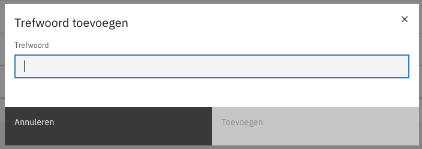
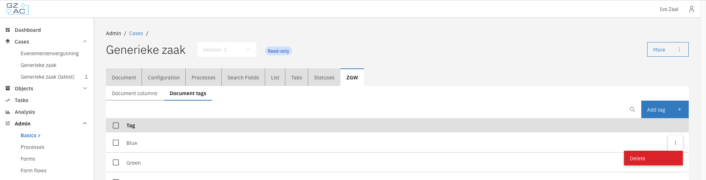
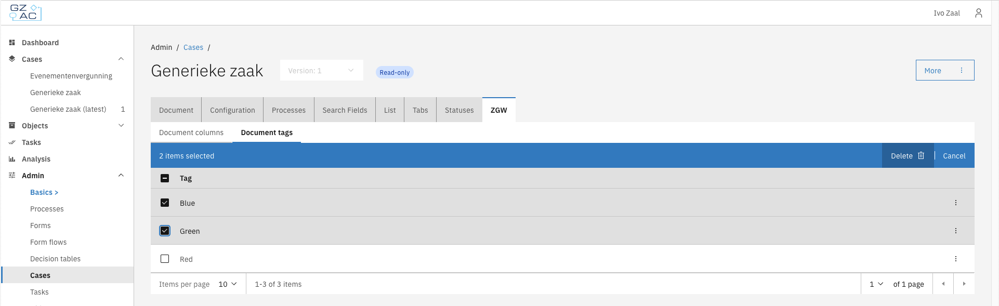

# Trefwoorden for uploaded files

When uploading to valtimo when using the documenten api, the uploaded files can be tagged with trefwoorden (tags).
This can be used to keep track of different files and to search for them, making it easier to manage files for a case
when there are a lot of them.

## Prerequisites

Trefwoorden can only be used when the documenten api is used. The documenten api needs to be configured and the 
documenten api plugin needs to be installed. It is only possible to use trefwoorden when using the 1.4 spec of the 
documenten api.

## Adding trefwoorden to a file

When uploading a file to the documenten api, the trefwoorden can be added to the file by selecting them in the upload 
modal. The tags field it available in available at the bottom of the left row as seen in the image below. 

The trefwoorden can be selected from the list of available trefwoorden. The list of trefwoorden is managed by an admin.

## Managing trefwoorden for a case type

Trefwoorden can be managed per case type. A sub tab is avilable for admins by going to 
`Admin -> Cases` in the menu and choosing a case type. In the case type, the section for trefwoorden is available by going to
the `ZGW` tab and selecting the `Document tags` sub tab. This tab will only become available when the version for the
documenten api is set to 1.4. or higher in the plugin configuration. 

### Adding trefwoorden to a case type

A new trefwoord can be added by selecting the 'Add trefwoord' button in the trefwoorden section of the case type. A modal
will be dispayed where the trefwoord can be entered.

### Deleting trefwoorden from a case type

Trefwoorden can be deleted by selecting the delete option from the overflow menu of the trefwoord.

It is also possible to delete multiple trefwoorden at the same time by using the multi select option in the list and 
deleting the selection.

Trefwoorden that are deleted will not be available for new files that are uploaded to the documenten api. Existing files
that are tagged with the trefwoord will still have the trefwoord attached to them.
