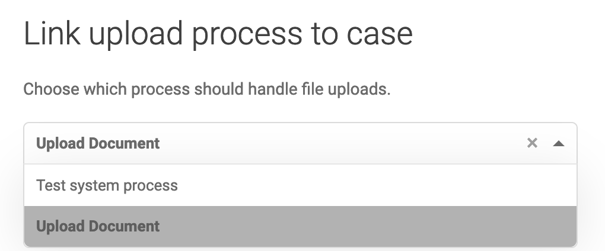
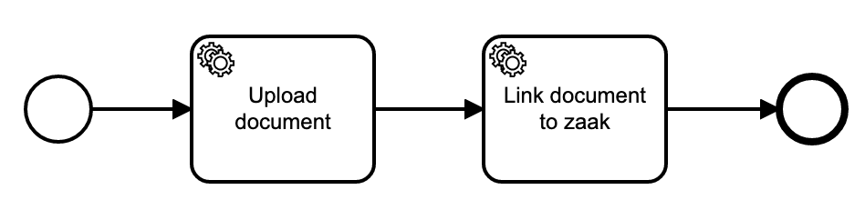
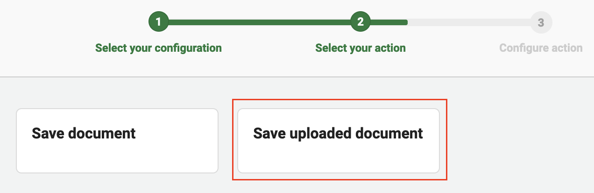
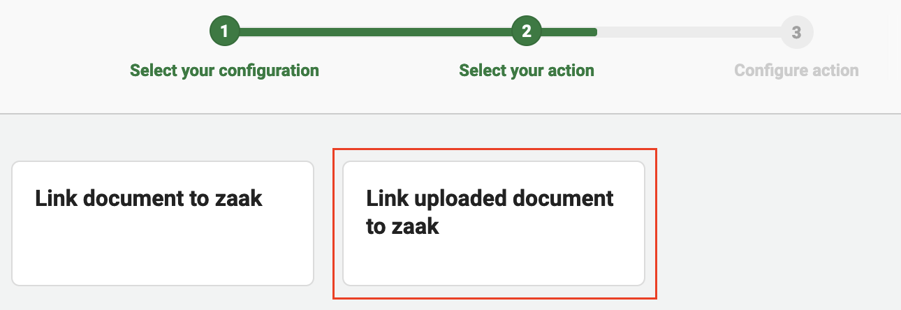

# Uploading to Documenten API with metadata

The Documenten API is an API for storage and disclosure of documents and associated metadata. Valtimo supports uploading
files to the Documenten API with the option to input metadata through a dedicated tab on the detail page of a case
instance, or through a custom Form.IO component.

## Configuring the Documenten API tab

To enable the dedicated Documenten API tab in an implementation, set `uploadProvider` in the implementation's
environment file to `UploadProvider.DOCUMENTEN_API`. The documents tab on a case detail page will now show the
Documenten API uploader.

## Configuring the Documenten API Form.IO upload component

In order to make the Documenten API File Upload component available in Form.IO forms in your implementation, import
`registerDocumentenApiFormioUploadComponent` from `@valtimo/components` in your app module and move it into the
`AppModule` constructor like so:

#### **`app.module.ts`**
  ```typescript
...
import {
    ...
    registerDocumentenApiFormioUploadComponent,
} from '@valtimo/components';

...
export class AppModule {
    constructor(injector: Injector) {
        ...
        registerDocumentenApiFormioUploadComponent(injector);
    }
}
  ```

Afterwards, the component is available under the advanced section in the form builder.

## Configuring the Case 'upload process'

When a document is uploaded to a case, the case will search for the connected 'upload process' to handle the upload. The
upload process needs to be configured on the case page:

1. Open the 'Admin' menu.
2. Go to the 'Cases' page.
3. Select the case that is going to handle uploads to the Documenten API.
4. Link the upload process under section 'Link upload process to case'.
5. Select the 'Upload Document', or select any custom process that can handle uploads.



## Configuring the Upload Document process

Every Valtimo implementation comes with a system process called: Upload Document. This process is meant to handle most
generic document uploads. The Upload Document process look like this:



By default, the Upload Document process does not do anything, so it will not upload anything yet. The process needs to
be configured first.

Process links can be used to configure the Upload Document process. The first service task called 'Upload document' can
be linked to a Documenten API plugin action called 'Save uploaded document'.
Look [here](../plugin/documenten-api/configure-documenten-api-plugin.md) for more information.



Configuring the first service task of the Upload Document process is enough to let Valtimo users upload their documents
to the Documenten API in Valtimo. But the documents will not be visible yet in case information within Valtimo. This is
because the document hasn't been linked to any zaak.

The second service task in the Upload Document process is called 'Link uploaded document to zaak'. The Zaken API plugin
can take care of this action. Look [here](../plugin/zaken-api/configure-zaken-api-plugin.md) for more information.


