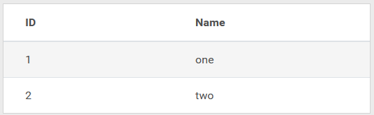
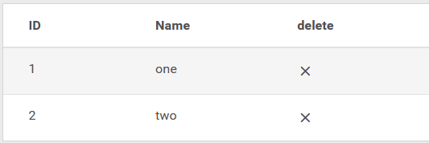

# Valtimo list

The valtimo list is a component to make building lists faster and easier. 

## Setting up a simple list

To create a simple list that only display some data, add the following to a component's html 

```angular2html
<valtimo-list
    [items]="items"
    [fields]="itemFields"
></valtimo-list>
```

Next, in the controller, add the following code

```typescript
public items: Array<any>;
public itemFields = [
{
    key: 'id',
    label: 'ID',
},
{
    key: 'nested.name',
    label: 'Name',
}
];

ngOnInit() {
    this.items = [ 
        { 
            id: 1, 
            nested: { name: "one" }
        }, {
            id: 2,
            nested: { name: "two"}
        }];
}
```

This will create a simple list that shows the two items. 



## Clicking on rows

The `(rowClicked)` property is used to add an action when the user clicks on a row

The property must be added with a reference to a method
```angular2html
<valtimo-list
    [items]="items"
    [fields]="itemFields"
    (rowClicked)="onItemClicked($event)"
></valtimo-list>
```

The method must be defined in the component's controller
```typescript
public itemClicked(item) {
    this.router.navigateByUrl("/items/"+item.id);
}
```

## Adding actions

The `[actions]` property is used to add clickable icons in the list

The property must be added with a reference to an array of actions
```angular2html
<valtimo-list
    [items]="items"
    [fields]="itemFields"
    [actions]="itemActions"
></valtimo-list>
```

The actions are defined in the component's controller
```typescript
public readonly itemActions: any[] = [{
  'columnName': 'delete',
  'iconClass': 'icon mdi mdi-close',
  'callback': this.deleteItem.bind(this)
}];

public deleteItem(item, $event) {
    const index = this.items.indexOf(item, 0);
    if (index > -1) {
        this.items.splice(index, 1); //remove item
    }
    
    $event.stopPropagation();
}
```

Note the `$event.stopPropagation()`, this stops any other click listeners from being triggered. Without this line the clickListener from the previous chapter would also run.

